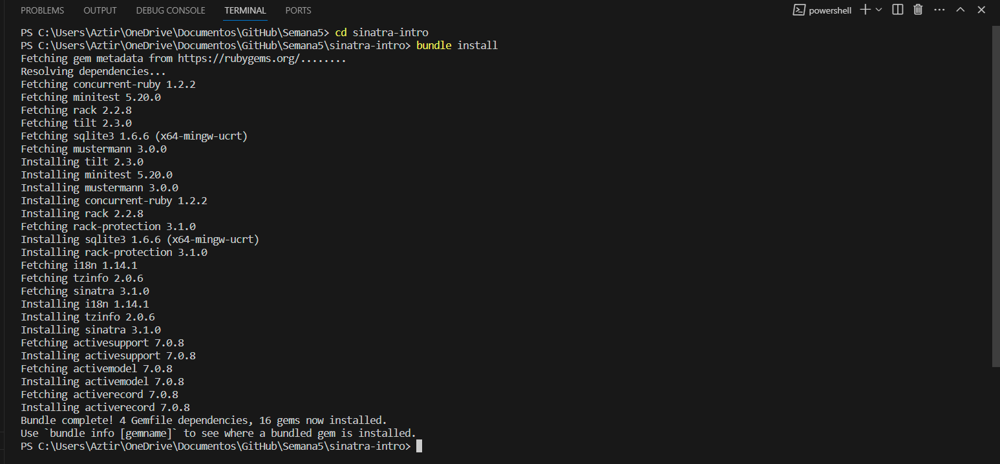

# **Demostración de MVC, rutas RESTful y CRUD con Sinatra**

## Configuración:

Ejecutamos el comando **`bundle install`** para instalar las gemas necesarias definidas en el archivo **`Gemfile`**.

```ruby
bundle install
```


Luego, iniciamos el servidor de Sinatra utilizando el comando **`ruby template.rb`** o **`bundle exec ruby template.rb`**.

```ruby
ruby template.rb
```


Abrimos nuestro navegador web y verificamos que la aplicación estuviera funcionando correctamente visitando la siguiente URL [http://localhost:4567/todos](http://localhost:4567/todos)


También utilizamos **`curl`** para realizar una solicitud GET y verificar la respuesta desde la línea de comandos:


# **Parte 1**

Aquí se implementan las operaciones CRUD (Create, Read, Update, Destroy) en el contexto de la entidad "Todo" (tareas pendientes).

## **Modelo: Clase `Todo`**

El modelo principal es la clase **`Todo`**. Cada instancia de esta clase representa una tarea pendiente que se almacena en la base de datos. Las operaciones CRUD se aplican a esta entidad.

## **Operaciones CRUD**

### **Index (Read)**

- **Ruta**: **`/todos`**
- **Método HTTP**: GET
- **Descripción**: Esta operación se utiliza para obtener una lista de todas las tareas pendientes existentes en la base de datos y mostrarlas en formato JSON en la ruta **`/todos`**.

### **Create**

- **Ruta**: **`/todos`**
- **Método HTTP**: POST
- **Descripción**: Esta operación permite agregar una nueva tarea pendiente a la base de datos cuando se realiza una solicitud HTTP POST a la ruta **`/todos`**. La nueva tarea debe incluir una descripción no vacía.

### **Read (Show)**

- **Ruta**: **`/todos/:id`**
- **Método HTTP**: GET
- **Descripción**: Esta operación se utiliza para mostrar los detalles de una tarea pendiente específica en la ruta **`/todos/:id`**, donde **`:id`** representa el ID único de la tarea. Si la tarea con el ID especificado existe, se devuelve su descripción en formato JSON.

### **Update**

- **Ruta**: **`/todos/:id`**
- **Método HTTP**: PUT
- **Descripción**: Esta operación permite actualizar una tarea pendiente existente en la base de datos cuando se realiza una solicitud HTTP PUT a la ruta **`/todos/:id`**. Se debe proporcionar una descripción no vacía para la actualización.

### **Destroy**

- **Ruta**: **`/todos/:id`**
- **Método HTTP**: DELETE
- **Descripción**: Esta operación se utiliza para eliminar una tarea pendiente existente de la base de datos cuando se realiza una solicitud HTTP DELETE a la ruta **`/todos/:id`**.

# **Parte 2**

## **Componentes de una URL**

Para comprender mejor las rutas y acciones, es importante conocer los componentes de una URL:

- **https://**: Indica que se utiliza el protocolo HTTPS, que es una versión segura de HTTP para la transferencia segura de datos.
- **[www.etsy.com](http://www.etsy.com/)**: Representa el dominio o la dirección del servidor web al que se accede.
- **443**: Es el número de puerto utilizado para la comunicación segura mediante HTTPS.
- **/search**: Es la ruta que especifica la ubicación en el servidor web a la que se accede.
- **q=test**: Es una cadena de consulta que envía datos al servidor, en este caso, busca la palabra "test".
- **copy**: Es un fragmento que se usa para identificar una sección específica de una página web, posiblemente llamada "copy".

En Sinatra, el enrutamiento y el controlador están acoplados, lo que facilita la declaración de rutas. Declaramos algunas rutas RESTful para que podamos ver una lista de tareas pendientes, crear una tarea pendiente, editar una tarea pendiente y eliminar una tarea pendiente. **¿Qué acciones RESTful deberíamos utilizar para estos?**

Las acciones RESTful que deberiamos utilizar para estas rutas son las siguientes:

1. Ver tareas pendientes:
    - Método GET: **`/todos`**
2. Crear tarea pendiente:
    - Método POST: **`/todos`**
3. Editar tarea pendiente:
    - Mostrar formulario (GET): **`/todos/:id/edit`**
    - Aplicar cambios (POST): **`/todos/:id`**
4. Eliminar tarea pendiente:
    - Método DELETE: **`/todos/:id`**

Estas son las rutas y métodos HTTP que utilizamos en nuestra aplicación Sinatra para gestionar nuestras tareas pendientes de manera efectiva.
# **Parte 3**

Dado que HTTP es un protocolo RESTful, cada solicitud debe ir seguida de una respuesta, por lo que debemos devolver una vista o redirigir a cada solicitud. Usaremos JSON para las respuestas, que es similar a lo que hacen muchas API. ¿Hacia dónde debería ir la respuesta?.

En una aplicación web que usa HTTP y devuelve respuestas en formato JSON:

- Las respuestas a solicitudes de lectura (GET) pueden incluir directamente el contenido JSON con código de estado 200.
- Las respuestas a solicitudes de creación o actualización (POST o PUT) pueden incluir detalles de la acción y el estado actualizado junto con códigos de estado 201 o 200.
- Las respuestas a solicitudes de eliminación (DELETE) pueden confirmar la acción con códigos de estado 204 o 200.
- Para redirigir, configura una redirección HTTP y especifica la nueva URL de destino."